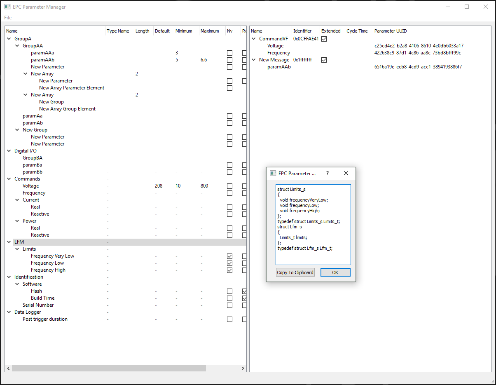

=================
Parameter Manager
=================

|AppVeyor| |GitHub|

.. |AppVeyor| image:: https://ci.appveyor.com/api/projects/status/jgv6i25s9b4g94ga/branch/master?svg=true
   :alt: AppVeyor build status
   :target: https://ci.appveyor.com/project/KyleAltendorf/pm

.. |GitHub| image:: https://img.shields.io/github/last-commit/altendky/pm/master.svg
   :alt: source on GitHub
   :target: https://github.com/altendky/pm

-------------------
Running From Binary
-------------------

Windows
=======

- Download artifact from the `build history on AppVeyor`_
- Extract contents of the ``.zip`` file
- Run ``epcpm.exe``

A minimal sample project is available at ``src/epcpm/tests/project/project.pmp``.

.. _`build history on AppVeyor`: https://ci.appveyor.com/project/KyleAltendorf/pm/history

-------------------
Running From Source
-------------------

Windows
=======

- Install `Python 3.7`_
- Install `Git`_
- ``git clone https://github.com/altendky/st``
- ``cd st``
- ``git submodule update --init``
- ``py create_venv.py ensure``

  - Run with any recent Python, the proper Python version will be selected

- wait
- wait some more...
- ...

To launch PM run ``venv\Scripts\epcpm.exe``.

.. _`Python 3.7`: https://www.python.org/downloads/
.. _`Git`: https://git-scm.com/download

Linux
=====

- Install Python 3.7

  - pyenv_ to get Python versions

- Install git
- ``git clone https://github.com/altendky/st``
- ``cd st``
- ``git submodule update --init``
- ``python create_venv.py ensure``

  - Run with any recent Python, the proper Python version will be selected

- wait
- a bit more, but not nearly as much as Windows

To launch PM run ``venv/bin/epcpm``

A minimal sample project is available at ``src/epcpm/tests/project/project.pmp``.

.. _pyenv: https://github.com/pyenv/pyenv
